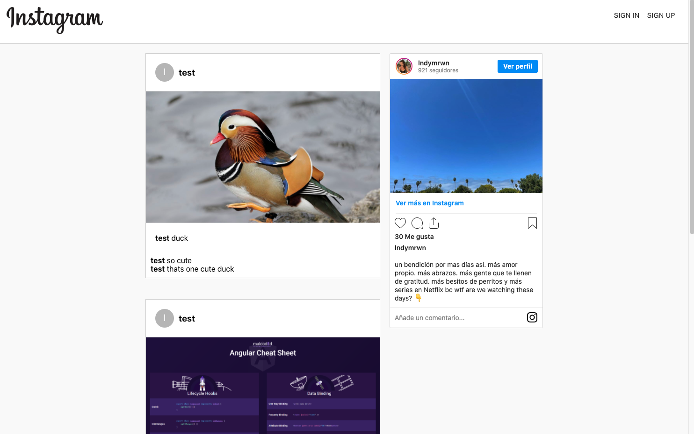

# Instagram Clone - React

## Description 
React project that uses Firebase services for real-time database storage and authentication.

## Table of Contents 
[Installation](#installation)

[Usage](#usage)

[Resources](#resources)

[Contributing](#contributing)

[Tests](#tests)

[Questions](#questions)
## Installation
Download the source code, then  run "npm install". 
the run, npm run start
Finally, (optional) if you want to use your own Firebase application go into /src/firebase.js and change the config object.

## Usage
In the top folder (with server.js) run "npm start". Alternately go to the deployed page https://bolsa-tober65.herokuapp.com/. 

On the sign up page enter a username, email, and password, then login with your email and password. 
You can then upload images, giving them a caption. 
When you are logged in you are also able to comment on photos. 

## Resources
A very special thank you to:

[Clever Programmer](https://www.youtube.com/channel/UCqrILQNl5Ed9Dz6CGMyvMTQ "Clever Programmer")

## Contributing
Feel free to contribute

## Tests
No tests at the moment

## Questions
Email: lindy.merwin@gmail.com

## Deployed link:
* [Instagram Clone in React](https://instagram-clone-d1536.web.app/ "Instagram Clone") -  Hosted on Firebase. 

This project was bootstrapped with [Create React App](https://github.com/facebook/create-react-app).

## Available Scripts

